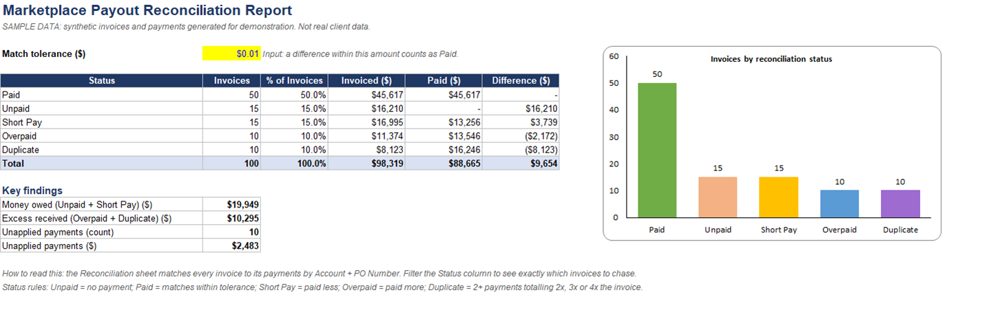
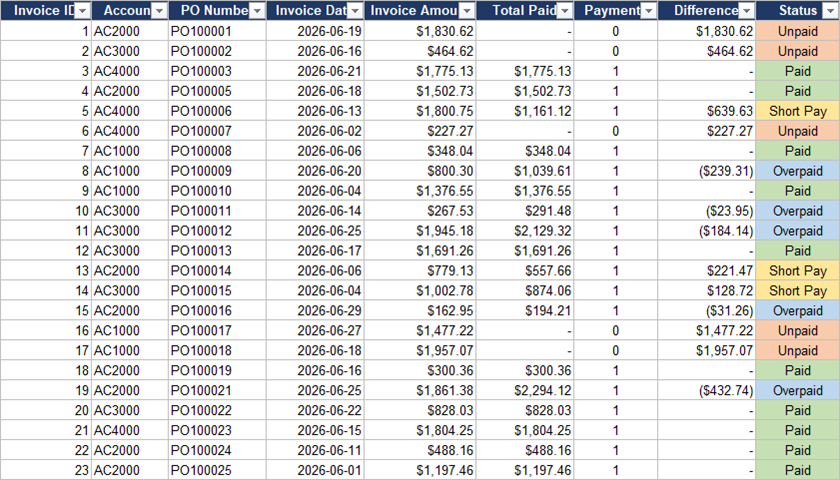

# Payout Reconciliation Report (Excel + Python)

An automated Excel report that matches invoices against payments and shows,
at a glance, **what was paid, what is missing, and what does not add up**.

> **Sample data.** Every invoice and payment in this project is synthetic,
> generated for demonstration. No real client data is used.



## The problem

When a business is paid through marketplaces, retailers or payment
processors, invoices and payments arrive separately and rarely line up
cleanly. Money quietly leaks through the gaps:

| Issue | What it means |
|---|---|
| **Unpaid** | Invoice issued, no payment received |
| **Short pay** | Paid less than the invoice amount |
| **Overpaid** | Paid more than the invoice amount |
| **Duplicate** | Same invoice paid two or more times |
| **Unapplied** | A payment arrived that matches no invoice |

Finding these by hand across hundreds or thousands of rows is slow and
error-prone.

## What this report delivers

- **Summary sheet:** invoice counts and dollar amounts per status, key
  findings (money owed, excess received, unapplied payments) and a chart.
- **Reconciliation sheet:** every invoice matched to its payments with the
  difference and a colour-coded status. Filter by status to see exactly which
  invoices to chase.
- **Payments sheet:** every payment flagged *Applied* or *Unapplied*.



## Built with live formulas, not pasted values

The workbook is fully formula-driven (`SUMIFS`, `COUNTIFS`, `IF`,
`COUNTIF`). Paste in a new month of data and every total, status and chart
updates automatically. The match tolerance is a single editable input
(`Summary!B4`).

## Reproduce it

```bash
pip install -r requirements.txt
python build_report.py
```

`build_report.py` reads `data/invoices.csv` and `data/payments.csv` and
writes `Sample_Payout_Reconciliation_Report.xlsx`. Open it in Excel and the
formulas calculate on load.

## Tech

Python (pandas, openpyxl) for generation, Excel formulas and conditional
formatting for the report itself.

## Related

The same reconciliation logic, implemented as a Python engine and in SQL,
is in
[dropship-reconciliation-engine](https://github.com/Adnan040404/dropship-reconciliation-engine).

## About

I'm Muhammad Adnan, a data analyst who works with financial reconciliation
and automation (Excel, Python, SQL, Power BI).
[LinkedIn](https://linkedin.com/in/muhammad-adnan-740336293) ·
adnandanish0404@gmail.com
